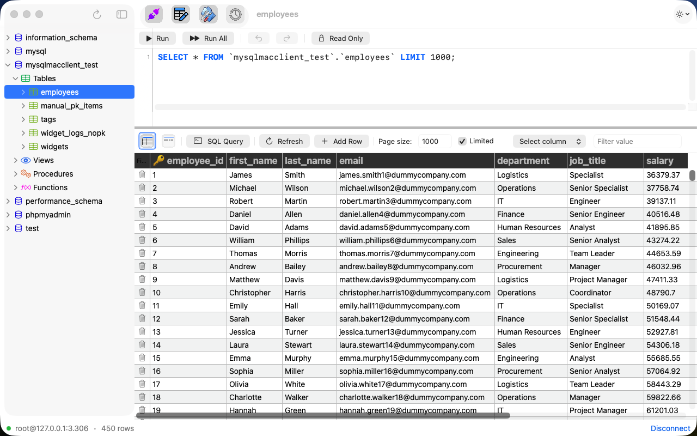
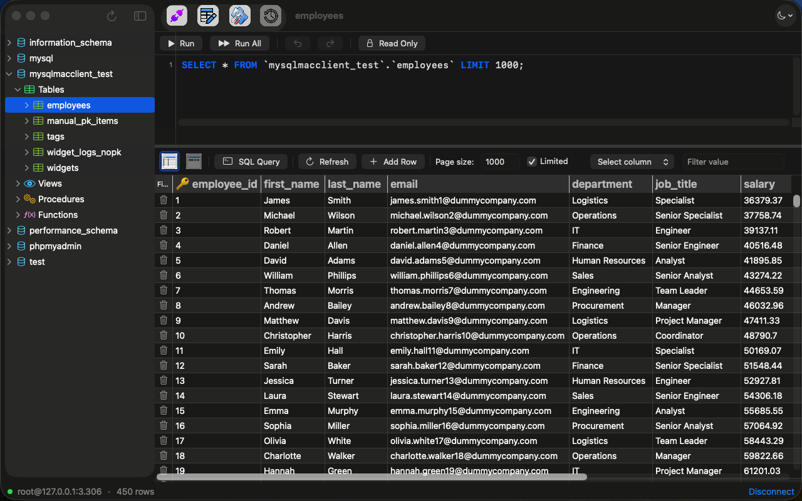
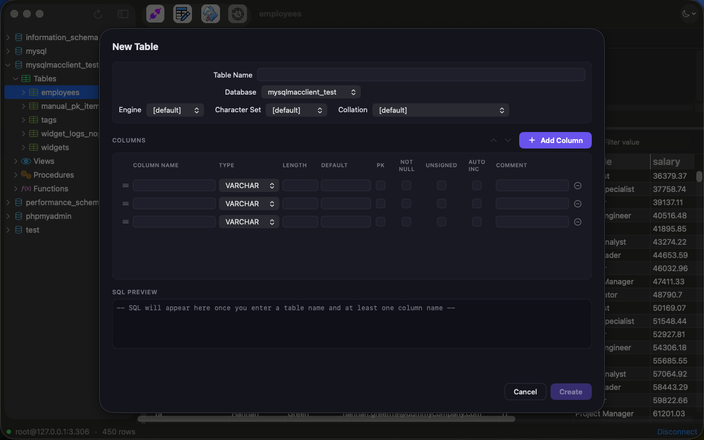
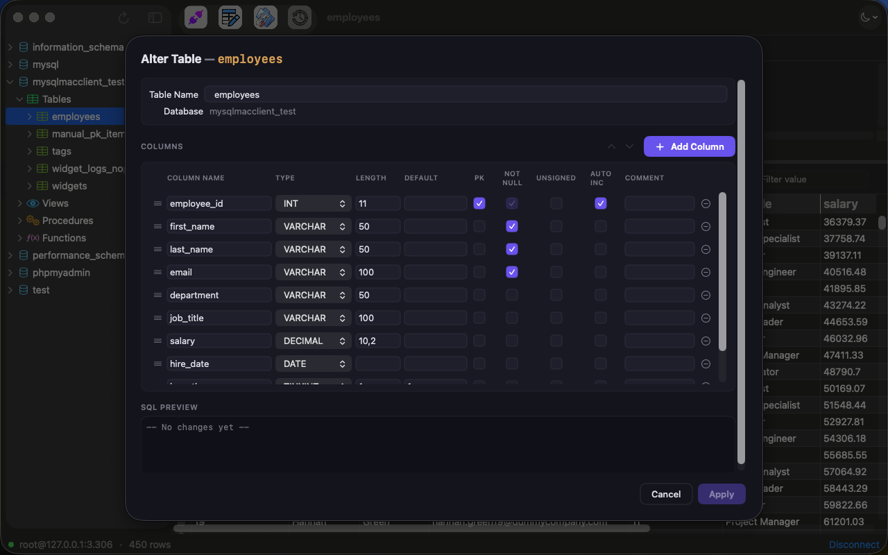

# MySQL Client

[](project.yml)
[](project.yml)

A native macOS MySQL management tool built with **Swift 6 / SwiftUI**, available in **English and Turkish**. Designed as a personal desktop client for managing MySQL databases — local (XAMPP) or remote (cPanel shared hosting, etc.).

> **Status:** Active development · Full-featured desktop client · App-sandboxed, packaged as a signed macOS app (DMG)

---

## Screenshots

<p align="center">
  
  
</p>
<p align="center">
  
  
</p>

---

## Features

### Connection Management
- Multiple connection profiles with named presets
- Passwords stored securely in **macOS Keychain** (never on disk)
- Connection metadata persisted in `~/Library/Application Support/MySQL Client/connections.json`

### Schema Browser
- Multi-database tree: databases → **tables, views, stored procedures, functions** (sidebar with `NavigationSplitView`), each category lazily loaded on first expand
- Table info panel (column details/types/keys, index list, DDL) and per-object context menus (Alter, Drop, Truncate)
- Create forms for View / Stored Procedure / Function / Trigger / Event, with `DELIMITER`-block script support for routine bodies

### Data Grid
- **NSTableView-backed spreadsheet grid** — performant with large result sets
- Inline cell editing with dirty-tracking (only changed columns generate `UPDATE`)
- Draft-row insert flow (blank row appended to the grid, nothing written until you leave it) with PK-aware SQL generation, plus row delete
- Column sorting and filtering (parameterized queries — no SQL injection)
- Pagination via keyset (primary-key range) or `OFFSET` fallback, with configurable page size

### SQL Query Panel
- Multi-line SQL editor with **syntax highlighting** (keywords, strings, numbers, comments)
- Tab / Shift-Tab indentation, Undo/Redo support
- Line numbers, current-line highlighting, gutter row selection
- Tabbed result sets for multi-statement queries / procedure calls returning several result sets
- Persistent **query history** (per connection profile), browsable and re-runnable from the toolbar
- Right-click SQL templates for quick `SELECT`, `INSERT`, `UPDATE`, `DELETE`

### Table Management
- **Create Table** form with column editor (name, type, length, nullable, default, auto-increment) — columns can also be suggested from a CSV or Excel file's header and sample data (type/length/nullability inferred, reviewable before creating; no data is imported, only the structure)
- **Alter Table** — add / modify / reorder / drop columns
- Column drag-and-drop reordering

### Export, Import & Backup
- **Table Export** — CSV, HTML, JSON, SQL, and hand-rolled `.xlsx` (no third-party dependency), streamed page-by-page so multi-million-row tables don't sit in memory; live progress bar and cancel
- **Table Import** — reads a CSV (streaming RFC4180 parser) or Excel `.xlsx` file (hand-rolled reader — DEFLATE-compressed archives, shared strings, multiple sheets, date-styled cells), auto-maps columns by header name (correctable per column), and writes every row inside a single transaction — all rows land or none do
- **Database Backup** — HeidiSQL-style SQL dump dialog: structure/data/both, `DROP` statements, extended inserts, `LOCK TABLES` / `--single-transaction`, tables + views + routines, with progress and cancel
- All file writes go through an atomic temp-file-then-replace step, so a failed or cancelled run never touches (or deletes) a pre-existing file at the destination

### Localization
- Full **English** and **Turkish** interface, driven by a String Catalog (`Localizable.xcstrings`)
- Follows the macOS system language by default, with an in-app override in Settings ▸ General ▸ Language (applied on next launch)
- Note: localization only resolves in a real `.app` bundle. Under `swift run` the catalog lives in `Bundle.module` while SwiftUI reads `Bundle.main`, so every lookup falls back to the English source string — use `scripts/run-localized.sh [en|tr|system]` to check translations

### Settings
- Light / Dark / System appearance picker
- Interface language (System / Türkçe / English)
- Sidebar width, grid row height, alternating row colors
- SQL editor font size configuration
- Grid ↔ Text view toggle for query results

---

## Tech Stack

| Layer | Technology |
|-------|-----------|
| Language | Swift 6 (strict concurrency) |
| UI | SwiftUI + AppKit (`NSTableView` for grids, `NSTextView` for SQL editor) |
| MySQL | [stokay/mysql-nio](https://github.com/stokay/mysql-nio) — a pinned fork of [vapor/mysql-nio](https://github.com/vapor/mysql-nio) adding `CLIENT_MULTI_RESULTS` support (needed for procedure calls returning result sets); pure Swift, async/await, no C bindings |
| Localization | String Catalog (`Localizable.xcstrings`), English source with Turkish translations |
| Secrets | macOS Keychain via Security framework |
| Build (dev) | Swift Package Manager — `swift run` / `open Package.swift`, no `.xcodeproj` needed day-to-day |
| Build (release) | [XcodeGen](https://github.com/yonaskolb/XcodeGen) generates a signed, App-Sandboxed `.xcodeproj` from `project.yml` for Release builds / DMG packaging (`scripts/build-dmg.sh`) |
| Target | macOS 15+ |

---

## Architecture

```
Sources/MySQLMacClient/
├── App/             # @main entry, AppDelegate, AppState
├── Models/          # ConnectionProfile, TableInfo, ColumnInfo, RowValue, TableRow
├── Services/        # MySQLService (actor), SchemaIntrospectionService, KeychainService
├── Persistence/     # ConnectionStore, QueryHistoryRecorder (JSON files)
├── Export/          # CSVExporter, HTMLExporter, JSONExporter, SQLExporter, XLSXExporter
│                    #   (hand-rolled zip/XML writer), AtomicFileWriter
├── Import/          # CSVImportParser (streaming RFC4180 reader), XLSXImportParser
│                    #   (hand-rolled zip/XML reader + inflate), MinimalZipReader
├── Localizable.xcstrings  # String Catalog: English source + Turkish/Spanish/German translations
├── ViewModels/      # TableDataVM, TableExportVM, TableImportVM, DatabaseBackupVM,
│                    #   SQLConsoleVM, SchemaTreeVM, AlterTableVM, CreateTableVM, ...
├── Views/           # SwiftUI views + AppKit bridging (SpreadsheetGridView, SQLTextView)
└── Resources/       # Bundled images / screenshots
```

**MVVM** with `@Observable` / `@StateObject` view models. Services own the MySQL connection lifecycle (`EventLoopGroup` + `MySQLConnection`). Primary key detection via `SHOW KEYS` enables safe cell-level editing; tables without a PK fall back to read-only mode with a visible banner.

---

## Getting Started

### Prerequisites
- **macOS 15+** and **Xcode 16+** (or Swift 6.0+ toolchain)
- A running MySQL server (local XAMPP, Docker, remote, etc.)

### Build & Run

```bash
# Clone
git clone https://github.com/stokay/MySQLClient.git
cd MySQLClient

# Build and run
swift run

# — or open in Xcode for full IDE experience —
open Package.swift
```

### Building a distributable `.app` / DMG

Day-to-day development runs straight off the Swift package (no `.xcodeproj`
needed), but a signed, App-Sandboxed build for real-world testing or
distribution goes through [XcodeGen](https://github.com/yonaskolb/XcodeGen)
+ `xcodebuild`:

```bash
scripts/build-dmg.sh
```

This regenerates `MySQLMacClient.xcodeproj` from `project.yml` (entitlements
included — don't hand-edit `MySQLMacClient.entitlements` directly, it gets
overwritten on every generate), builds a Release `.app`, and packages it
into `MySQLMacClient-<version>.dmg` in the repo root.

> Sandbox-gated behavior (file open/save panels, network access) only
> reflects reality in this signed build — `swift run` doesn't actually
> enforce App Sandbox, so a sandbox permission bug can look fine there and
> still fail in the packaged app.

### First Connection
1. Launch the app → the connection form appears
2. Fill in host, port (default 3306), username, password, and a connection name
3. Click **Connect** — the sidebar populates with databases and tables
4. Select a table to browse/edit data in the grid

> **Note:** If your MySQL 8+ server uses `caching_sha2_password`, you may need to switch to `mysql_native_password` for MySQLNIO compatibility:
> ```sql
> ALTER USER 'your_user'@'%' IDENTIFIED WITH mysql_native_password BY 'your_password';
> ```

---

## Roadmap

- [x] Connection form with Keychain-based password storage
- [x] Multi-database schema tree
- [x] NSTableView data grid with inline editing
- [x] PK-aware INSERT / UPDATE / DELETE generation
- [x] SQL query editor with syntax highlighting
- [x] Create Table / Alter Table forms
- [x] Settings panel (appearance, grid, editor)
- [x] Query history persistence
- [x] Schema tree with views, stored procedures and functions
- [ ] Browse triggers and events in the schema tree (create forms already exist; they just aren't listed in the tree yet)
- [x] Table Export (CSV, HTML, JSON, SQL, Excel) with streaming + progress + cancel
- [x] Table Import (CSV and Excel `.xlsx`) with column mapping and all-or-nothing transaction
- [x] Database Backup (SQL dump — structure/data, routines, extended inserts)
- [x] Packaged `.app` bundle with icon & Info.plist, App Sandbox entitlements, DMG build script
- [x] English, Turkish, Spanish and German localization with an in-app language picker
- [ ] Connection pooling — `MySQLService` currently holds a single connection per session, serialized behind a FIFO acquire/release gate (the wire protocol can't have two requests in flight at once); a long-running export/backup and interactive grid browsing today queue behind each other rather than running on separate connections

---

## License

Personal project — no license specified.
